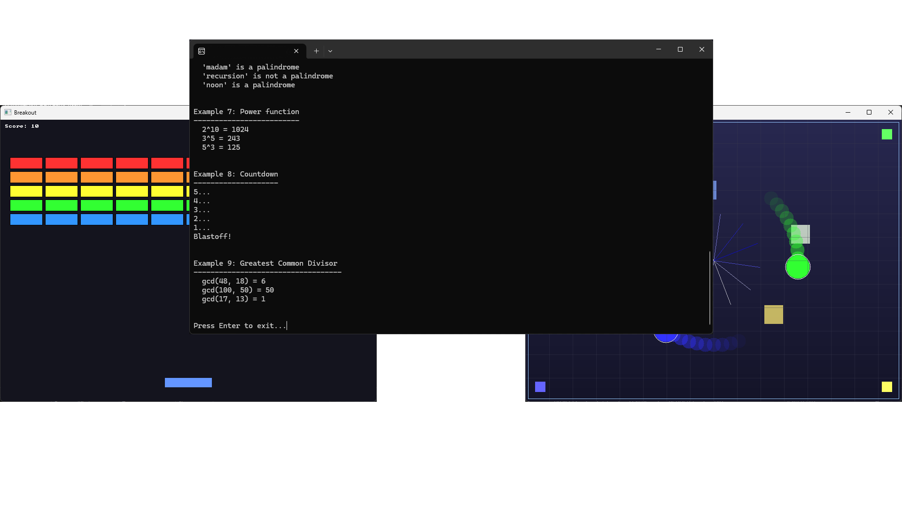

  

---

### Learn C by building real programs.

---

## What's Here

### Basics
Learn C syntax and fundamentals through working examples. Variables, pointers, functions, memory - everything you need to write real C code.

[→ Go to Basics](Basics/)

### Algorithms
Classic algorithms with visual output. Sorting (bubble, merge, quick), searching (binary), recursion, and backtracking. See Big O in action.

[→ Go to Algorithms](Algorithms/)

### Data Structures
Build data structures from scratch. Linked lists, stacks, queues, trees, hash tables, graphs, heaps. See how they actually work internally.

[→ Go to Data Structures](DataStructures/)

### Game Programming
Make actual playable games. Snake, Pong, Breakout using the renderer. Learn game loops, collision detection, input handling, state machines.

[→ Go to Game Programming](GameProgramming/)

### Memory Management
Master manual memory management. Debug leaks, build custom allocators (arena, pool, stack), understand malloc/free internals.

[→ Go to Memory Management](MemoryManagement/)

### Networking
Network programming with sockets. TCP/UDP clients and servers, multi-client handling, HTTP basics, file transfer.

[→ Go to Networking](Networking/)

### Renderer
Software rendering from scratch - everything runs on CPU, no GPU. 2D graphics, 3D projection, lighting, particles, and a simple game.

[→ Go to Renderer](Renderer/)

---

  

